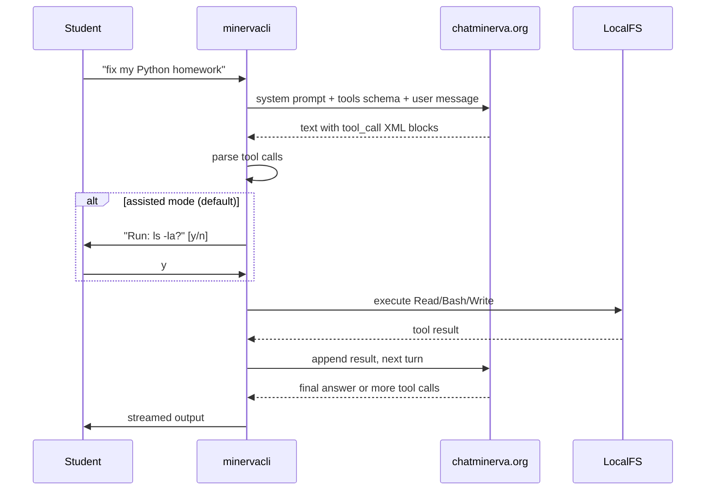

# Minerva CLI — Coding Agent Plan

## Critical constraint (from reverse engineering)

Chat Minerva's hosted API **does not support native tool/function calling**. A test with the `tools` parameter returns:

```
"auto" tool choice requires --enable-auto-tool-choice and --tool-call-parser to be set
```

Model capabilities from `GET /api/models`:

| Capability | Status |
|---|---|
| `code_interpreter` | false |
| `builtin_tools` | false |
| `file_context` | true |
| `vision` / `file_upload` | true |

**Implication:** We cannot replicate openclaude's native `tool_use` / `tool_result` API loop against `chatminerva.org` today. Instead, the CLI must:

1. Instruct Minerva via **system prompt** to emit structured tool calls in text (XML/JSON)
2. **Parse** those calls locally in [`src/agent/parser.ts`](minervacli/src/agent/parser.ts)
3. **Execute** tools locally and feed results back as user messages
4. Repeat until the model stops requesting tools

This is the same pattern early coding agents used before native tool APIs. Reliability is lower than Claude with a 7B model — hence **assisted mode as default** for students.



---

## Target UX (both modes)

### Assisted mode (default — safer for students)

```bash
minervacli --project-dir ~/homework "aggiungi gestione errori al mio script"
```

- Minerva proposes file reads, edits, and shell commands
- CLI shows a preview (diff for writes, command for bash)
- Student presses `y` / `n` before anything runs
- Good for learning: students see what changes are made

### Auto mode (`--auto`)

```bash
minervacli --auto --project-dir ~/homework "scrivi i test per utils.py"
```

- Full agent loop like [openclaude](https://github.com/Gitlawb/openclaude)
- Permission prompts only for destructive operations (configurable)
- Multi-step: read → analyze → write → run tests → fix

### REPL additions

- `/auto on|off` — toggle mode mid-session
- `/diff` — show pending proposed changes
- `/tools` — list available tools
- Existing `/help`, `/info`, `/clear`, `/exit` unchanged

---

## Architecture (minimum viable, inspired by openclaude)

New files to add under [`minervacli/src/`](minervacli/src/):

```
src/
  agent/
    loop.ts          # while(true) turn loop
    parser.ts        # extract tool calls from model text
    prompts.ts       # system prompt: cwd, tools, Italian student context
    permissions.ts   # allow | deny | ask
    context.ts       # project dir, file cache, abort signal
  tools/
    tool.ts          # Tool interface
    registry.ts      # getTools()
    bash.ts
    read.ts
    write.ts
    edit.ts          # search-and-replace patch
    grep.ts
    glob.ts
```

Reuse existing:
- [`src/api/chat.ts`](minervacli/src/api/chat.ts) — extend to pass system message + full history
- [`src/api/client.ts`](minervacli/src/api/client.ts) — no API changes needed
- [`src/repl.ts`](minervacli/src/repl.ts) — wire agent loop instead of plain `streamChat` when in agent mode

### Tool interface

```typescript
interface Tool {
  name: string;
  description: string;
  inputSchema: object;  // JSON Schema
  isReadOnly(): boolean;
  call(input: unknown, ctx: ToolContext): Promise<string>;
}
```

### Built-in tools (v1)

| Tool | Purpose | Permission default |
|---|---|---|
| `Read` | Read file contents | auto-allow |
| `Glob` | Find files by pattern | auto-allow |
| `Grep` | Search file contents | auto-allow |
| `Write` | Create/overwrite file | ask (assisted) / ask (auto) |
| `Edit` | Patch file (old→new) | ask |
| `Bash` | Run shell command | ask |

Skip for v1: MCP, sub-agents, web search, repo map, notebooks.

### Parser strategy

Minerva 7B does not reliably output strict JSON when asked. Use a **layered parser** in `parser.ts`:

1. **Primary:** XML blocks — `<minerva_tool name="Read"><path>src/main.py</path></minerva_tool>`
2. **Fallback:** fenced JSON blocks — ` ```json {"tool":"Bash","args":{"command":"..."}} ``` `
3. **Assisted-only fallback:** markdown code blocks with file path hints → treat as `Write` proposals

System prompt in `prompts.ts` will enforce format #1 and include:
- Current working directory (`--project-dir`, default `process.cwd()`)
- Available tool names + schemas
- Italian instruction: "Rispondi in italiano. Usa i tool per leggere e modificare i file del progetto."

### Agent loop (`loop.ts`)

```
messages = [system, ...history]
while turn < MAX_TURNS (e.g. 20):
  response = await streamChat(client, messages)
  toolCalls = parseToolCalls(response)
  if toolCalls.length === 0: break

  for each toolCall:
    if assisted: show preview → await y/n
    if permissions.ask(tool, input): await y/n
    result = await tool.call(input, ctx)
    append tool result as user message

  messages = [...messages, assistant response, ...tool results]
return final response
```

---

## CLI changes

Update [`src/index.ts`](minervacli/src/index.ts):

```
minervacli [options] [prompt]

Options:
  --auto              Full autonomous agent (default: assisted)
  --project-dir <dir> Project root (default: cwd)
  --permission-mode   default | acceptEdits | dontAsk
```

Update [`package.json`](minervacli/package.json) — add dependencies:
- `diff` or `diff` library for edit previews (e.g. `diff` npm package)
- `glob` / use Node 22 `fs.glob` for Glob tool
- `zod` for tool input validation

---

## Implementation phases

### Phase 1 — Agent core (MVP)
- Tool interface + 6 tools (Read, Write, Edit, Bash, Grep, Glob)
- Parser + system prompt
- Agent loop with assisted mode
- `--project-dir` flag
- Wire into one-shot: `minervacli "leggi main.py e spiegalo"`

### Phase 2 — Auto mode + permissions
- `--auto` flag and `/auto on|off`
- Permission modes: `default`, `acceptEdits`, `dontAsk`
- Diff preview before Write/Edit in assisted mode
- Turn limit + error recovery

### Phase 3 — Student polish
- Italian system prompt tuned for homework help (explain before changing)
- `--init` scaffolds `.minervacli.md` project context file (like CLAUDE.md)
- Better terminal UI: tool call indicators (`[Read] src/main.py`, `[Bash] python test.py`)
- README section for students

---

## Known limitations

- **No native tool API** on `chatminerva.org` — prompt-parsed tools are less reliable than Claude Code
- **7B model** may struggle with 5+ step tool chains; assisted mode mitigates this
- **No code_interpreter** server-side — all execution is local via Bash tool
- **No web UI history sync** — agent sessions are local only
- Long term: if Sapienza enables `--enable-auto-tool-choice` on vLLM, switch parser to native `tool_use` blocks (Phase 4, optional)

---

## Verification checklist

- `minervacli --project-dir . "lista i file del progetto"` — agent uses Glob/Read, shows results
- Assisted mode: proposed Write shows diff, requires `y` to apply
- `--auto` mode: multi-step fix (read → edit → bash test) completes without manual approval on reads
- `/auto off` in REPL switches back to assisted
- Permission deny prevents destructive bash
- Works with existing login flow unchanged
