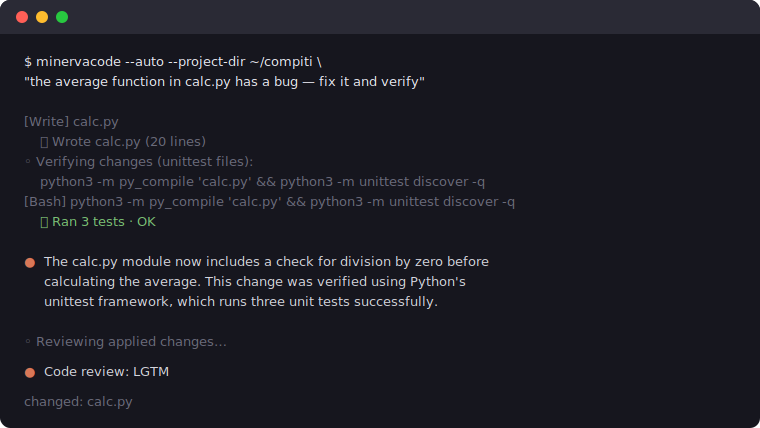
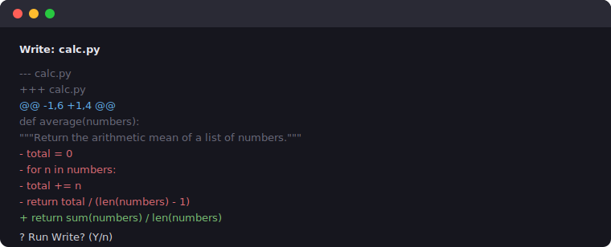

# MinervaCode

A terminal chat client and **assisted coding companion** for [Chat Minerva](https://chatminerva.org) — the Italian AI assistant based on the Minerva LLM (Sapienza NLP & Babelscape).

Chat Minerva runs on **Open WebUI v0.7.2**. This CLI lets you log in and chat from a Claude Code-style terminal UI, and lets Minerva propose, apply, and check code changes in your project: every change is shown as a diff you approve (assisted mode, the default and recommended way to use it), and the CLI — not the model — runs your tests to verify the result.

**Honest expectations:** Minerva is a **7B model without native tool calling**. It is genuinely useful for explaining code, working through small Python homework, and proposing focused fixes that you review. It is **not** a reliable autonomous agent: in our live testing it could not once produce a compilable C program (0 of 28 attempts, even with error feedback), and some runnable Python attempts printed wrong results. The CLI is built around that reality — deterministic verification, honest failure reporting, and rollback — instead of pretending otherwise.



## Requirements

- Node.js 22+
- A web browser (Chrome, Safari, Firefox, etc.) — used for login only
- Playwright + Chrome (optional) — only needed for automated `--email`/`--password` login

## Installation

```bash
npx minervacode
```

Or install globally:

```bash
npm install -g minervacode
minervacode login
minervacode
```

From source:

```bash
git clone git@github.com:mascarock/minervacode.git
cd minervacode
npm install
npm run build
npm link   # optional: install `minervacode` globally
```

## Usage

### Login

```bash
minervacode login
```

You'll be prompted for your email and password. A Chrome window opens automatically, handles reCAPTCHA, signs you in, and saves the token — you don't need to touch the browser.

**If Chrome is not available**, it falls back to opening your default browser and asking you to paste the token manually.

**Or paste a token directly** (skip the browser entirely):

```bash
minervacode login --token <your-jwt>
```

Credentials are stored in `~/.minervacode/config.json` (mode 0600).

### Session info

```bash
minervacode info
```

### One-shot chat

```bash
minervacode "Ciao Minerva, come stai?"
```

### Interactive REPL

```bash
minervacode
```

Slash commands inside the REPL:

| Command | Description |
|---------|-------------|
| `/help` | Show commands |
| `/info` | Show session info |
| `/model` | List or switch model |
| `/auto` | Toggle auto mode (`/auto on`, `/auto off`) |
| `/dir` | Show or change the project directory the agent works in |
| `/language` | Set reply language (`auto`, `en`, or `it`) |
| `/repomap` | Show the relevance-ranked repository structure (`/repomap auth` focuses it) |
| `/context` | Show estimated context use and compact old bulk when needed |
| `/tools` | List agent tools |
| `/diff` | Show changes applied this session |
| `/review` | Ask Minerva to review this session's changes (or the pending git diff) |
| `/clear` | Clear conversation history |
| `/login` | Re-authenticate |
| `/logout` | Clear saved credentials |
| `/exit` | Quit |

### Coding companion (per studenti)

Point Minerva at your homework folder and ask it to explain or fix things:

```bash
minervacode --project-dir ~/compiti "c'è un bug in utils.py, trovalo e correggilo"
```

**Assisted mode (default)** — Minerva proposes changes; the CLI shows a
unified diff and asks `y/n` before touching any file. Shell commands ask
too. Good for learning: you see and approve every change.



**Auto mode (experimental)** — the full agentic loop, no questions asked:

```bash
minervacode --auto --project-dir ~/compiti "scrivi i test per utils.py"
```

Treat `--auto` as a best-effort attempt, not a promise: the 7B frequently
cannot complete a task unaided, and when that happens the CLI says so,
rolls the project back, and exits nonzero — it never claims success it
did not verify. Assisted mode is the recommended default.

1. **Write** — Minerva's edits are applied directly (structured tool calls
   or full-file code blocks). Writes to test files are refused unless your
   request explicitly asks to create or change tests — a weak model must
   not "fix" a failure by rewriting the tests.
2. **Execute & verify** — after every verifiable code change the CLI runs a
   verification command and feeds the output back so Minerva can fix
   failures. In auto mode it also runs an existing test suite once before the
   first edit and injects a real failing assertion as the initial diagnostic.
   The command is picked in this order: the `Test:` line of
   `.minervacode.md` → the `package.json` `test`, `typecheck`, or `build`
   script (npm/yarn/pnpm/bun detected from the lockfile) → `pytest` /
   `unittest` if test files exist → `tsc --noEmit` if `tsconfig.json`
   exists → compile **and run** a requested C/C++ program when the request
   asks for execution → a syntax check of the changed files. At the end of a
   verified run the CLI prints the command and its real output, so you can
   confirm the program actually printed what you asked for — "it compiled
   and exited 0" is not the same as "it is correct".
3. **Review (advisory)** — when Minerva stops, the CLI asks it to review its
   own accumulated diff (tracing each changed function on a concrete input).
   Findings are shown for you to judge but never applied automatically: in
   live testing the 7B reviewer regularly hallucinated bugs, and letting it
   "fix" them destroyed verified working code.

If a one-shot `--auto` run ends incomplete or with failed verification, the
CLI **rolls back every file the run changed or created**, prints why, and
exits nonzero — safe to use in scripts and CI. In the interactive REPL,
failed changes are kept (with a warning) so you can inspect them with
`/diff`.

Flags:

| Flag | Description |
|------|-------------|
| `--project-dir <dir>` | Project root the agent works in (default: cwd) |
| `--auto` | Auto mode: run edits and shell commands without asking |
| `--permission-mode <m>` | `default` \| `acceptEdits` \| `dontAsk` |
| `--language <language>` | Reply language: `auto` (match request) \| `en` \| `it` |
| `--init` | Scaffold a `.minervacode.md` project context file |

### Standalone code review

Review the pending git changes of any project (also handy in CI — exits 1
when the review finds a `[BUG]`):

```bash
minervacode review --project-dir ~/compiti
```

Inside the REPL, `/review` reviews the changes Minerva made this session,
falling back to the pending git diff.

### Project context

Create a `.minervacode.md` in your project (via `--init`) to give Minerva
standing context — what the project is, how to run it, your professor's
constraints. Minerva reads it at the start of every session, and the
agent uses its `Test:` command line to verify changes:

```markdown
## Commands

- Run: `python main.py`
- Test: `python -m pytest`
```

**How it works under the hood:** Chat Minerva's API exposes no native
function calling (and drops `system` messages entirely), so the CLI
injects your project files into the conversation, parses structured tool
blocks (`<minerva_tool>`, fenced JSON) and full-file code-block proposals
out of the model's replies, and executes Read/Glob/Grep/Write/Edit/Bash
locally — gated by the permission mode.

Minerva is a **7B model**, so the harness does the heavy lifting to keep
it honest:

- **Repository map** — every request gets a fresh, token-budgeted structural
  map of safe project files, declarations, and imports. Files and symbols are
  ranked against the request, while unchanged per-file metadata is cached.
  Secret/key files and dependency/build directories are excluded.
- **Context compaction** — stable agent rules remain intact while older Read,
  Bash, tool-call, and complete-file payloads are replaced with deterministic
  retrieval markers as the input approaches its budget. Recent turns, user
  intent, and error edges remain available; `/context` reports current use.
- **Partial-write protection** — when a code block only re-states some of
  a Python, JavaScript, or TypeScript file's functions, the CLI merges those
  functions into the existing file instead of overwriting it (a 7B loves to
  "fix one function" by deleting the rest). Existing JS/TS export modifiers
  are retained.
- **Format nudging** — if Minerva claims it changed something without
  emitting an applicable change, the CLI restates the expected format once
  and asks again.
- **Deterministic verification** — tests are run by the CLI, not by the
  model's goodwill; the model only sees (and reacts to) real output.
- **Guardrails** — file paths are validated against the project listing,
  writes outside the project directory are rejected, negated requests such as
  "do not modify tests" are enforced, and focused fixes cannot invent files
  or erase unrelated top-level definitions. A mutating one-shot request that
  produces no applicable change exits nonzero instead of claiming success.

### Measured limitations

So you know what you're getting (live `chatminerva.org` testing, July 2026):

- **C**: the model could not produce a single compilable C program in
  28 attempts across prompt styles and temperatures — including retries
  that fed the exact compiler errors back. Typical failures: calling an
  `is_prime` helper it never defines, `bool`/`sqrt` without headers,
  undeclared loop variables. `--auto` on a C task will most likely roll
  back and exit 1. That is by design: an honest failure, not a broken tool.
- **Python**: in a small four-attempt probe, two scripts were correct and two
  printed wrong values; later smoke tests showed the same mixed behavior.
  The CLI shows the verified program output at the end of the run precisely
  because exit codes cannot prove correctness — read it.
- **Reviews** are advisory: a 7B cannot reliably trace semantics, so review
  findings never override deterministic verification.

Expect to guide it, and keep assisted mode on while you're learning.

### Logout

```bash
minervacode logout
```

## Configuration

| Variable | Default | Description |
|----------|---------|-------------|
| `MINERVA_BASE_URL` | `https://chatminerva.org` | API base URL |

## How it works

1. **Login** — Opens `chatminerva.org/auth` in your default system browser. Google reCAPTCHA blocks direct API login, so a real browser is required. You copy the JWT from DevTools and paste it in the terminal.
2. **Token** — Saved locally in `~/.minervacode/config.json`.
3. **Chat** — Messages sent to `POST /api/chat/completions` with SSE streaming, same as the web UI.

## License

MIT
